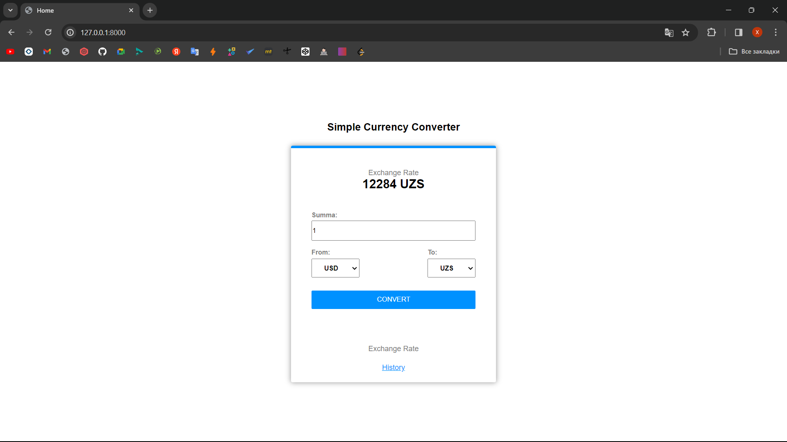
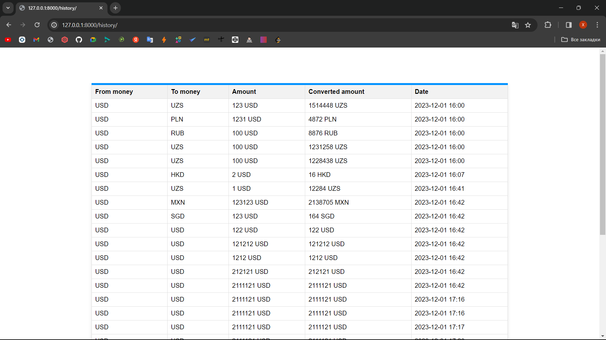
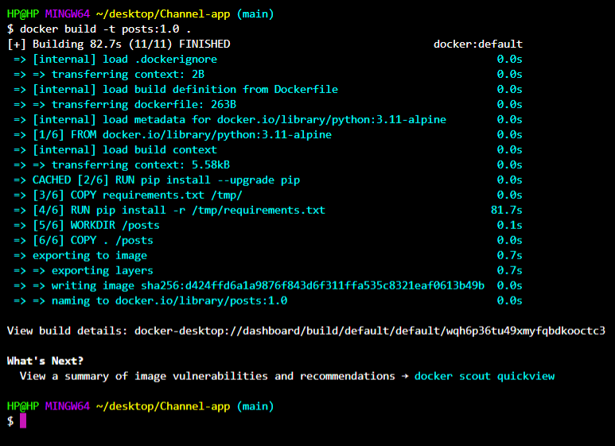

# Currency-app
   
    

Currency App deb nomlangan ushbu Django loyihasi postlar yozishga mo'ljallangan
- [Docker o'rnatish](#docker)
- [O'rnatish](#o'rnatish)
- [Run](#run)

## Docker o'rnatish

1. **Dockerni yuklash**
   Sizda qanday OS bo'lsa https://www.docker.com/products/docker-desktop/ bu linkga kirib OS in tanlab yuklab oling

2. **Terminal code orqali yuklash**
   
   Macos uchun
   ```bash
   sudo hdiutil attach Docker.dmg
   sudo /Volumes/Docker/Docker.app/Contents/MacOS/install
   sudo hdiutil detach /Volumes/Docker
   ```
   Windows uchun
   ```bash
   choco install docker-desktop
   ```
   Linux uchun
   ```bash
   sudo apt-get update
   sudo apt-get install ./docker-desktop-<version>-<arch>.deb   
   ```
   Endi esa https://hub.docker.com/_/python shu linkdan python image ni yuklab oling
## O'rnatish

1. **Clone qilish**
   ```bash
   git clone https://github.com/abubakirovxolmirza/Currency-app


2. **Docker orqali packetlar o'rnatish**
   ```bash
   docker build -t currency:1.0 .
   ```
   

## Run qilish
   ```bash
   pipenv shell 
   python manage.py runserver
   ```
Ana endi o'zingizga kerakli valyutani tanlab uni o'giring, siz qilgan amaliyotlaringizni history tugmasini bosib ko'rinshingiz mumkin.
   
